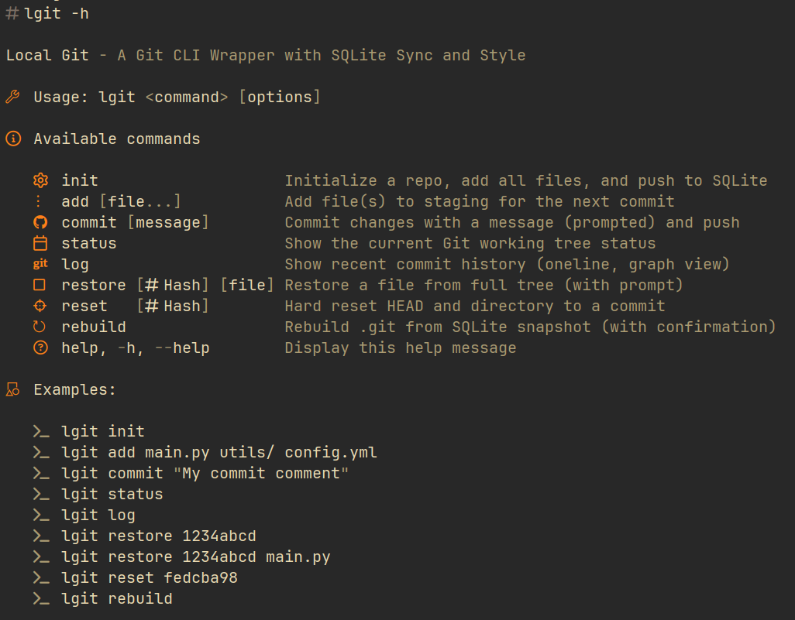

🧩 lgit – Local Git: A Simple Git CLI Wrapper Script with SQLite Sync and Style - Luciano Federico Pereira

lgit is a sleek, nerd font-enhanced shell script that wraps common Git workflows with SQLite-powered push/pull functionality. 

Designed for terminal lovers, it offers a curated set of subcommands (init, add, commit, status, log, restore, reset, rebuild) to streamline Git operations 
in local directories—plus it syncs changes via a Git remote powered by a local SQLite .db file.

    📦 Minimal setup: lgit init bootstraps a Git repo with SQLite integration

    📝 Styled output: colorful headers, Nerd Font icons, and box-drawing eye candy

    💾 Syncs commits to/from git.db using git-remote-sqlite protocol

    🔄 Recover state with rebuild, restore, and reset using friendly prompts

    ✨ Built-in help: lgit -h shows all commands and usage examples

Use it as a personal Git frontend or as part of a reproducible local history workflow. Fast, functional, and terminal-native.

## 🧰 Usage:

  lgit <command> [options]

📚 Available commands:

**init**                   Initialize a repo, add all files, and push to SQLite 

**add** [file...]          Add file(s) to staging for the next commit 

**commit** [message]       Commit changes with a message (prompted) and push 

**status**                 Show the current Git working tree status 

**log**                    Show recent commit history (oneline, graph view) 

**restore** [Hash] [file]  Restore a file from full tree (with prompt) 

**reset**   [Hash]         Hard reset HEAD and directory to a commit 

**rebuild**                Rebuild .git from SQLite snapshot (with confirmation) 

**help, -h, --help**       Display this help message 

 
💡 Examples: 
  lgit init 
  lgit add main.py utils/ config.yml 
  lgit commit "My commit comment" 
  lgit status 
  lgit log 
  lgit restore 1234abcd 
  lgit restore 1234abcd main.py 
  lgit reset fedcba98 
  lgit rebuild 

